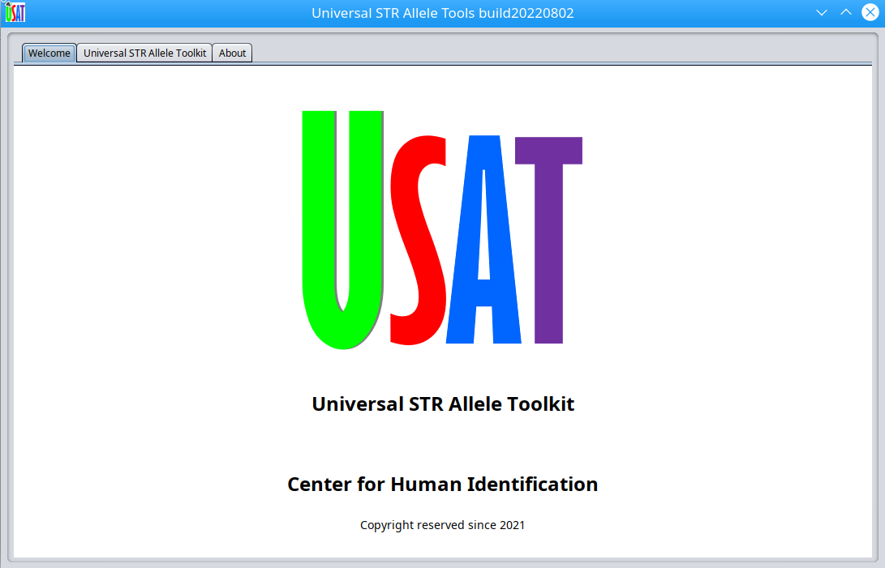

# USAT
## Universal STR Allele Toolkit (USAT)

USAT is a bioinformatic software with a graphic interface for universal Tandem Repeat (TR)  including short TR (STR) analysis. It takes the haplotype output from many existing softwares as the input. 

The main motivation is to compare the size or length or sequence of haplotype sequences which are highly similar, and to output the comparison results in alignment or resizbale interactive graph. USAT provides a solution for deep comparison of haplotype sequences of TR in graphic interface in all major computing systems of Windows, MacOS, and Linux.

The USAT is fullly programmed in Java and, it is ready for running with just mouse clicks.

Latest version: v1.2

## License
The USAT is under the General Public License v3.0. Free to distibute and improve. Free for all academic and educational purposes. A license is needed to be obtained from us for any industrial and any other purposes. Please contact us.

## Functions of USAT
USAT has many functions for haplotype comparison, plot, and visualizion for detailed TR haplotype comparison to provide informative clues of difference between any alleles, including

1. TR allele interactibe viewing, sorting, filtering 
2. Graphic plot the distribution of alleles and comparison
3. Haplotype sequence alignment and comprison
4. Caculation of allele length in bp to the number of repeat time  (allele size)

This helps to improve accuracy  and identification for TR or STR genotyping in human forensic and disease DNA analysis.

## Computing system requirement
USAT can run across multiple computing systems. The tested systems include:

Windows 10

Mac OS 11.6.5

Linux: Ubuntu 20.4

USAT may work in other systems if Java could run there although we did not test.

## Installation
### Step 1. Download the software from Github
 
 `git clone https://github.com/XuewenWangUGA/USAT`
 
 `cd USAT`
 
 or use the Github click to download from "code" button.
  
 
 ### Step 2. Get demo and settings 
  
  Download the subdirectories `testData` and put `testData` under the directory USAT
                  
  Download the subdirectories `settings` and put `settings` under the directory USAT
  
  This step is for demo data and demo settings.
    
                  
###  Step 3. Get or update the dependency
 
 #### For Windows user:
 
 Download maffinwin from https://mafft.cbrc.jp/alignment/software/windows_without_cygwin.html  and unzip the download files into `maffinwin` under the directory USAT. 
 Go to folder  "maffinwin" , create a new folder "tmp"
   
 
#### For Linux and MacOS users: 
 
Donwload the Linux installation file from https://mafft.cbrc.jp/alignment/software/linux.html and install it. After that, to export the mafft path into environment.

Donwload the MacOS installation file from https://mafft.cbrc.jp/alignment/software/macosx.html and install it. After that, to export the mafft path into environment.

Command to export path: 

assume you installed the mafft and the bin excutable is in the direct called /your/path/to/mafft/

`export PATH=$PATH: /your/path/to/mafft/`
 
   
 
 or download whole package from Github https://github.com/ge-lab using Github download button.
 
 
 #### Update Java run environment if necessary
 The USAT will use the Java runtime enviroment V17. If your computer has an old version of Java runtime, please install the newest Java 17 or Java SE Development Kit 17.0.4 or higher from  https://www.oracle.com/java/technologies/downloads/  . Either Java or SE should work.

 
 ## Run USAT
 
 🔑 Before running USAT, please read through user manual 📗   __USAT_user_manual.pdf__
 
 __Briefly__
 
 Method 1: Go to the USAT folder, double click the __USAT.jar__ file to run
 
 or 
 
 Mehotd 2: to run through a command terminal; just type the following command and press the "enter" key
 
`java -jar USAT.jar`

## Format of haplotype sequence as the 1st input file
USAT takes a sequence file with haplotype sequence(s) for each TR or STR.
The format is a tabular text file with data like marker1 <tab> haplotype sequence <tab> SampleID, one haplotype per line. If there are multiple haplotypes, the same marker ID could be used for each locus. Lines with # can be used annotation or comments which will be ignored by USAT. 
 
 e.g.,
 #CODIS core STR loci for HG002		
 
#Marker_Name	Sample_haplotype	SampleID
 
  MK1 CTATCTATCTATCTATCTATCTATCTATCTATCTATCTATCTAT S1
 
  MK1 CTATCTATCTATCTATCTATCTATCTATCTATCTATCTATCTATCTATCTATCTATCTAT S0
  
  A test dataset is provided with the software release.
 

## Format of the BED file as the 2nd input file
 USAT take a  BED file for specific information at each locus
 The locus information is given in BED format in plain text file (https://genome.ucsc.edu/FAQ/FAQformat.html#format1). Fields are separated by a tab. It starts with a head line  with "Chrom" and then one TR marker locus per line. Multiple marker loci can be put in a file, just put in subsequent lines. e.g.,
 
 |Chrom	| ChromStart |	ChromEnd  | Name	   |Left_offset	|Right_offset	|Basic_motif_period	|Ref_hap_length	|  Motif	                     |Ref_allele	|Inner_offset	| Min_stutter_threshold |
 |:---- |  -------:  |  -------: | :-----: |   -------: |    -------: |          -------: |         ----: | :-------------------------: |      ---: |        ---: |                      ---: |
 |chr1	 |  230769615	| 230769683 |	D1S1656 |         3	 |           3	|                 4	|            68	|   CCTA[TCTA]nTCA[TCTA]n 	|        17 |           0 |                      0.1  |
 |chr2|218014858|218014950|D2S1338|3|3|4|92|[GGAA]nGGAC[GGAA]n[GGCA]n|23|0|0.1|
 
 If you don't know the value of some columns, you can put 1. However, the first four columns must be unique across all TR loci.
 
## Start interface

Once USAT is started, you will see a start interface. 

 
## Input interface
 
 Click the "Universal STR Allele Toolkit" tab to go to input interface.
 
 click __Browse__ button to choose input files. 
 
 A demo data is provided for a testing run. Just follow the above installation steps to put the demo data into the expected directory and then click "Load demo data". This will automatically load the demo data which consist of two input files into the input boxes above. Then click bottom "run" to run. After click the button "run", USAT will process the data set and output the results. Or an user could click button "Browse" to choose the demo data if not use the button "Load demo data". 
 
 
 
## Output
  All outputs will be displayed in graphic interfaces in an interactive manner and also can be saved as file as needed using the save botton.
 
 Allele and comparison table as shown in the below image. This table is interactive data sheet, which could be sorted, drag and drop to change the order of a column, filter etc.
 
 Each row is for one haploptype with the folllowing information.
 
 the column "AutoID" for the automatic line number,
 
 the column "Check" for selection of a haplotype in a row,
 
 the column "Marker" for the name of the marker or locus,
 
 the column "Allele_size" for the size of allele which is calculated repeated times using the recommendations from the national forensic database CODIS,
 
 the column "Length_(bp)" is the number of nucleatide bases,
 
 the column "Sequence" is the sequence of a haplotype,
 
 the column "SampleID" is the information of sample names, e.g., the name of a DNA source,
 
 

 
 Allele size/length will be compared in allele size or nucleotide base pair. For detailed steps, please read the manual.
 
 
 
 Sequences of selected allele haplotypes from multiple DNA sources can be compared in an alignment view, and the asterisk is for 100% consistence between/among alleles.
 
  
 
 The user manual explaines and demonstrates the details on how to use each function.
 
 ## Citing USAT
 USAT is under a consideration of offical publication somewhere.
 The preprint of manuscript is available at https://www.biorxiv.org/content/10.1101/2022.04.15.488513v1.article-metrics
 
 To cite:   
 doi: https://doi.org/10.1101/2022.04.15.488513
  
