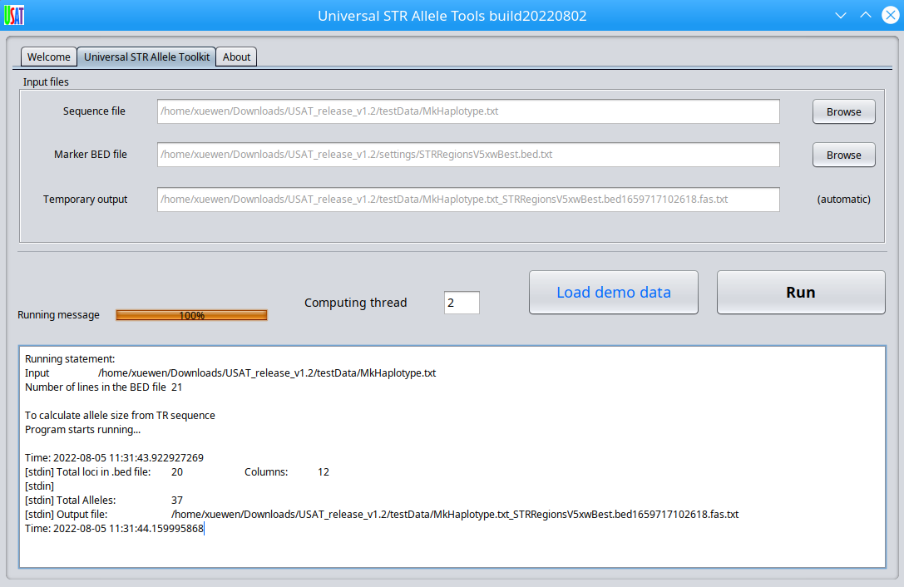

# USAT
## Universal STR Allele Toolkit (USAT)

USAT is a bioinformatic software with a graphic interface for universal Tandem Repeat (TR) allele manipulation toolkit, including short TR (STR). It is free for all acdemic and educational purposes. Industrial and business users need to obtain license. Please contact for more information.
The USAT is full programmed in Java and, it is ready for running with mouse clicks only after downloading this software,so no installation is needed.

Latest version: v1.1

## License
Free for all academic and educational purposes. A license is needed to be obtained from us for any industrial and any other purposes. Contact us at 
HSC Center for Human Identification
CBH, 6th Floor
3500 Camp Bowie Boulevard
Fort Worth, TX 76107
Local: 817-735-0606
Fax: 817-735-0553

## Function of USAT
USAT conducts detailed TR haplotype comparison and graphic plot to provide informative clues of difference between any alleles.
TR allele intreactibe viewing, sorting, filtering, and comparison. 
Graphic plot the distribution of alleles and comparison. 
Haplotype sequence comprison
Converting allele length in bp to repeat time based allele size. 

## Installation and run
Download the software and subdirectories from Github. e.g. for software
 
 `git clone https://github.com/XuewenWangUGA/USAT`
 
 or 
 
 Download the software release zip file into your computer, unzip it into a directory called "USAT". 
 
 Go to the USAT folder and double click to run. This software will use a new version of Java runtime enviroment V17. If your computer has an older version, please install the newest Java runtime enviroment V17 or higher from https://www.oracle.com/java/technologies/downloads/#jdk17-windows 
 
 Run USAT
 
 method 1: double click the USAT.jar to run
 
 or mehotd 2 in command terminal, type 
 
` java -jar USAT.jar`

For more information, please read user mannual: ### USAT_user_manual.pdf

## Format of haplotype sequence as 1st input file:
USAT takes a sequence file with haplotype sequence for each STR and an optional BED file for specific information at each locus.
The format is a tabular text file with data like marker1 <tab> haplotype sequence <tab> SampleID, one haplotype per line. If there are multiple haplotypes, the same marker ID could be used for each locus. Lines with # can be used annotation or comments. 
 
 e.g.,
 #CODIS core STR loci for HG002		
 
#Marker_Name	Sample_haplotype	SampleID
 
  MK1 CTATCTATCTATCTATCTATCTATCTATCTATCTATCTATCTAT S1
 
  MK1 CTATCTATCTATCTATCTATCTATCTATCTATCTATCTATCTATCTATCTATCTATCTAT S0
  
  A test dataset is provided with the software release for testing.

## Format of the BED file as the 2nd input file
 The locus information is given in BED format in plain text file (https://genome.ucsc.edu/FAQ/FAQformat.html#format1). Fields are separated BY tab. It starts with a head line and then one marker locus per line. Multiple markers can be used. e.g.,
 
 |Chrom	| ChromStart |	ChromEnd  | Name	   |Left_offset	|Right_offset	|Basic_motif_period	|Ref_hap_length	|Motif	                      |Ref_allele	|Inner_offset	| Min_stutter_threshold |
 |:---- |  -------:  |  -------: | :-----: |   -------: |    -------: |          -------: |         ----: |:-------------------------: |      ---: |        ---: |                      ---: |
 |chr1	 |  230769615	| 230769683 |	D1S1656 |         3	 |           3	|                 4	|            68	|  CCTA [TCTA]n TCA [TCTA]n 	|        17 |           0 |                      0.1  |

 
## Input interface
 click Browse button to choose input files.
 
 
## Output
 
 All output will be displayed in graphic interface in an interactive manner.
 
 Allele table and comparison

 
 Allele size/length comparison
 
 
 Allele comparison for multiple DNA sources
  
 
 ## Citing
 USAT is under consideration for publication.
  
